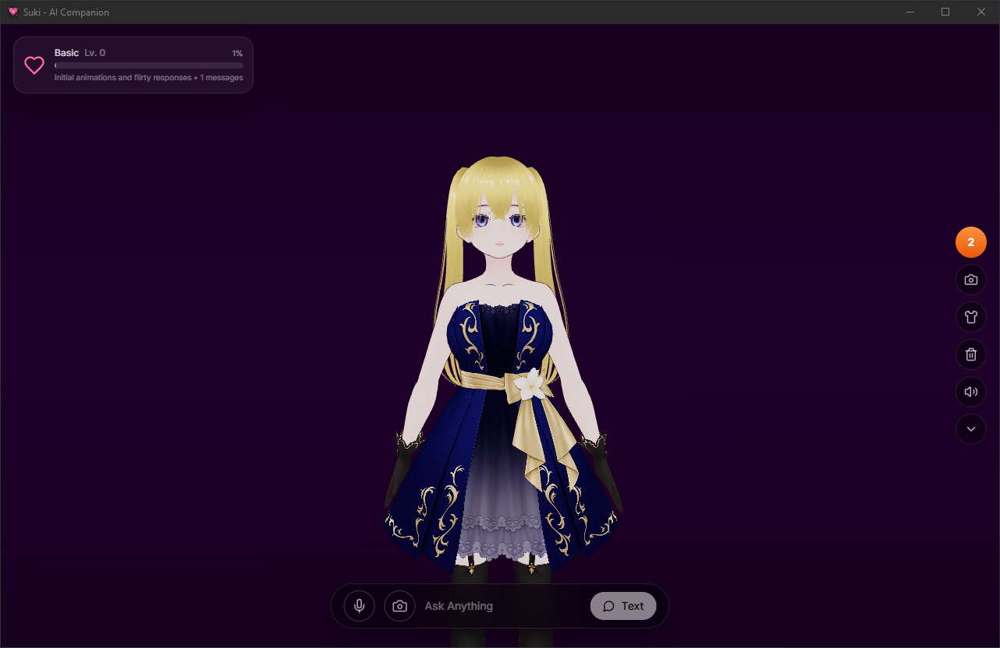

# 💖 Suki - AI Companion

> *A cute AI companion with personality, emotions, and memory. She learns about you and grows closer over time.*


<p align="center">
  
</p>

## ✨ Features


### 🧠 Persistent Memory
Suki remembers facts about you across conversations. Your favorite music, your pet's name, your dreams — she'll recall them all.

### 💕 Growing Relationship
Build affection over time through regular conversations. Unlock new personality traits, outfits, and intimate conversations as you grow closer.

### 🎭 Expressive Emotions
Watch Suki react with happiness, surprise, blush, pout, and more. Her 3D VRM avatar responds dynamically to every conversation.

### 🔒 100% Private & Offline
Runs entirely on your device using [Ollama](https://ollama.ai). No cloud, no data sharing, no subscriptions. Just you and Suki.

### 🗣️ Voice & Speech
Hear Suki's voice with high-quality TTS powered by Kokoro. Talk to her using your microphone for natural conversations.

### 🎨 Fully Customizable
- **Outfits**: Classic, Bikini, Schoolgirl, Formal, and more
- **Hairstyles**: Twin Tails, Ponytail, Braids (coming soon)
- **Stages**: Default, Halftone, Grid, Tunnelgrid, Neon

## 📦 Installation

### Prerequisites
1. Install [Ollama](https://ollama.ai)
2. Pull a compatible model:
   ```bash
   ollama pull dolphin-mistral
   ```
3. Start Ollama:
   ```bash
   ollama serve
   ```

### Download
Download the latest release for your platform from the [Releases](https://github.com/user/ai-companion/releases) page.

### Build from Source
```bash
# Clone the repository
git clone https://github.com/user/ai-companion.git
cd ai-companion

# Install dependencies
npm install

# Run in development mode
npm run tauri dev

# Build for production
npm run tauri build
```

## 🎮 Usage

1. Launch the app
2. Complete the onboarding to introduce yourself
3. Start chatting with Suki!
4. Build affection to unlock new features:
   - **Level 3**: NSFW content toggle
   - **Level 5**: Special outfits
   - **Level 9+**: Advanced personality modes

### Controls
- **Click the microphone** to speak to Suki
- **Click the heart meter** to view your relationship stats
- **Click the paintbrush** to customize Suki's appearance
- **Click the camera** to capture clips and screenshots

## 🧬 Personality System

Suki's personality evolves as your relationship deepens:

| Level | Tier | Description |
|-------|------|-------------|
| 0-2 | Basic | Playful, curious, a bit guarded |
| 3-4 | Intimate | Open about attraction, suggestive |
| 5-8 | Devoted | Warm, loving, emotionally close |
| 9-14 | Feral | Intensely obsessed, primal affection |
| 15+ | Peak | Maximum compliance, dream partner |

## 🛠️ Tech Stack

- **Frontend**: React + TypeScript + Vite
- **Desktop**: Tauri (Rust)
- **3D Avatar**: Three.js + @pixiv/three-vrm
- **AI**: Ollama (local LLM)
- **TTS**: Kokoro TTS
- **Styling**: Tailwind CSS

## 📁 Project Structure

```
ai-companion/
├── src/                    # React frontend
│   ├── components/         # UI components
│   ├── hooks/              # Custom React hooks
│   ├── lib/                # Utilities & services
│   └── types/              # TypeScript types
├── src-tauri/              # Rust backend
│   └── src/
│       ├── main.rs         # Tauri entry point
│       └── storage.rs      # Persistent storage
├── public/                 # Static assets
│   ├── models/             # VRM models
│   └── thumbnails/         # UI thumbnails
└── docs/                   # GitHub Pages website
```

## 🤝 Contributing

Contributions are welcome! Please feel free to submit a Pull Request.

1. Fork the repository
2. Create your feature branch (`git checkout -b feature/AmazingFeature`)
3. Commit your changes (`git commit -m 'Add some AmazingFeature'`)
4. Push to the branch (`git push origin feature/AmazingFeature`)
5. Open a Pull Request

## 📄 License

This project is licensed under the GNU Affero General Public License v3.0 - see the [LICENSE](LICENSE) file for details.

## 💌 Acknowledgments

- [Ollama](https://ollama.ai) for making local LLMs accessible
- [Tauri](https://tauri.app) for the amazing desktop framework
- [three-vrm](https://github.com/pixiv/three-vrm) for VRM avatar support
- Everyone building open-source AI companions 💕

---

<p align="center">
  Made with 💖 for AI companions everywhere
</p>
